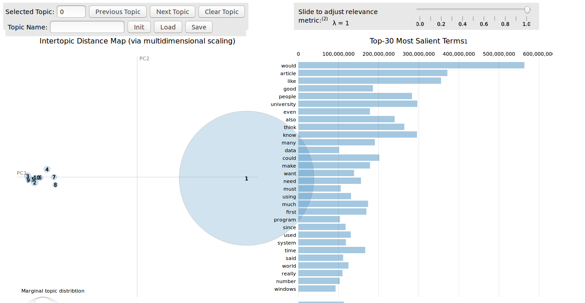

A vanilla Scala port of https://github.com/bmabey/pyLDAvis using Apache Spark as backend

### With SBT
- TODO:  add Spark Package support - Inprogress

# Jupyter-Scala Setup
 - http://blog.thedataincubator.com/2017/04/spark-2-0-on-jupyter-with-toree/
 - https://gist.github.com/mikecroucher/b57a9e5a4c1a1a2045f30a901b186bdf
 
# Examples
- [Data Preparation](examples/src/main/scala/DataPreparation.scala)
- [Scala LDA Visulaization](examples/src/main/scala/LDAVis.scala)
- [pyLDAvis Code Exploration](examples/python/pyLDAvis.ipynb) 
- [Prebuild artifacts](examples/tmp/scalaLDAvis)
 
  
 #References
 - http://www.jmlr.org/papers/volume3/blei03a/blei03a.pdf
 - http://ai.stanford.edu/~ang/papers/nips01-lda.pdf
 - https://nlp.stanford.edu/pubs/llda-emnlp09.pdf
 - https://nlp.stanford.edu/events/illvi2014/papers/sievert-illvi2014.pdf
 - https://github.com/bmabey/pyLDAvis
 
 #Dataset
 - [20 Newsgroups](http://www.cs.umb.edu/~smimarog/textmining/datasets/)